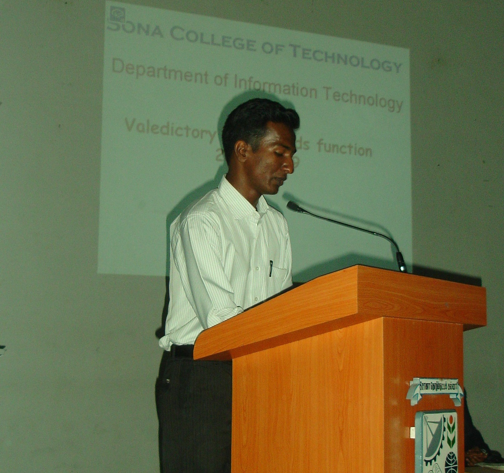
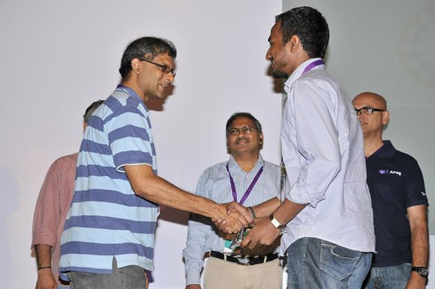
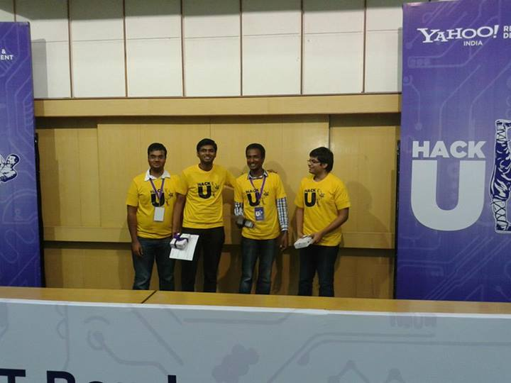
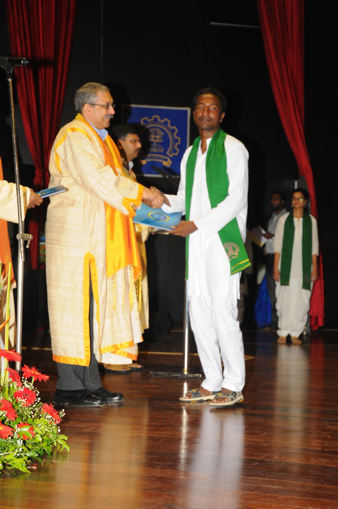
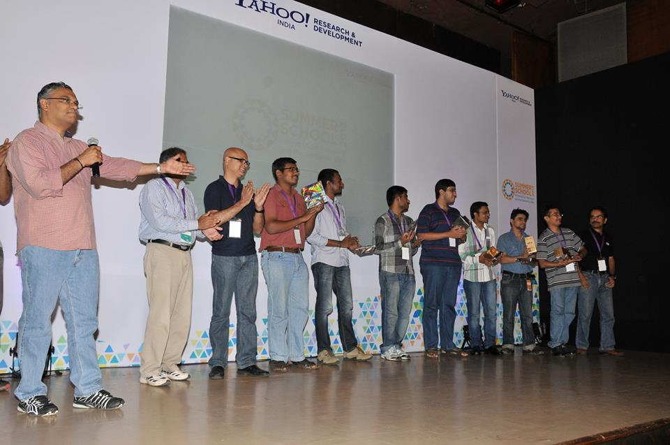



Jayaprakash Sundararaj is an Applied Researcher and Lead Engineer at Google in Mountain View, where he heads a small team primarily focused on Search Ranking and Recommendations. 

At Google, Jayaprakash worked on Web Search Ranking, <a href="https://www.lifewire.com/what-is-android-system-intelligence-7109550"> Android SysUI and Intelligence </a> , and Google <a href="https://play.google.com/store/search?q=car%20racing%20games&c=apps"> Play Store Search and Suggest</a>. He completed his Masters in Computer Science and Engineering at <a href="https://www.cse.iitb.ac.in/~jayaprakash12/"> IIT Bombay </a> , where he was advised by <a href="https://en.wikipedia.org/wiki/Pushpak_Bhattacharyya"> Pushpak Bhattacharya </a>.

  <a href="mailto:osjayapraksh@gmail.com"> Email </a> &nbsp;/&nbsp;
  <a href="https://www.linkedin.com/in/osjayaprakash/"> Linkedin </a> &nbsp;/&nbsp;
  <a href="https://drive.google.com/file/d/1oHFzc3pP8wtzEdMu9WsKu8SG6M2d8CNZ/view?usp=sharing"> Resume </a> &nbsp;/&nbsp;
  <a href="https://scholar.google.com/citations?user=jPdxJqgAAAAJ"> Google Scholar </a> 

### Expertise
* Areas: Natural Language Processing, Machine Learning, Artificial Intelligence, Information retrieval
* Programming: C++, Kotlin, Python
* Frameworks: Tensorflow, MapReduce (~Spark), BigTable/SSTable (~HBase/Cassandra), Protobuf (Data Serialization)

### News
* [2024] Launching new Search Home in Google Play Store. This work is covered in:
  * [Android Central](https://www.androidcentral.com/apps-software/google-app-bottom-search-bar-redesign-on-android)
  * [Android Headlines](https://www.androidheadlines.com/2024/03/google-play-store-search-tab-in-bottom-bar.html)
  * [Mobile Syrup](https://mobilesyrup.com/2024/03/20/google-play-store-ditching-search-bar-for-search-button/) 
* [2022] Launching On-Device-Search in Pixel Phones. This work is covered in:
  * [Android Police](https://www.androidpolice.com/app-pixel-launcher-search-all-android-phones/)
  * [Android Central](https://www.androidcentral.com/pixel-launcher-will-now-auto-name-folders-march-feature-drop)
  * [Android Police](https://www.androidpolice.com/2020/03/04/pixel-launcher-folder-names-based-on-apps/)
  * [9to5Google](https://9to5google.com/2020/03/04/pixel-launcher-folder-name-suggestion/) 
* [2021] Launching Smart-Folder Suggestions in Android Home Launcher.
* [2019] Launching Fact-checking articles in Google News. Covered in:
  * [Google Blog](https://blog.google/products/search/fact-check-now-available-google-search-and-news-around-world/)
  * [Google Blog](https://blog.google/outreach-initiatives/google-news-initiative/how-we-highlight-fact-checks-search-and-google-news/)
  * [Gaurdian](https://www.theguardian.com/technology/2017/apr/07/google-to-display-fact-checking-labels-to-show-if-news-is-true-or-false)
  * [Poynter](https://www.poynter.org/fact-checking/2017/google-is-now-highlighting-fact-checks-in-search/)
  * [Bloomber](https://www.bloomberg.com/news/articles/2017-04-07/google-brings-fake-news-fact-checking-to-search-results)
* [2014] Joined Google Search (Core Ranking) Team to work Query and Document Understanding.
* [2013] Internship at Yahoo, Inc.  I worked on improving image understanding, which was to improve Image Search results.
* [2013] Participating and Winning Yahoo, HackU (<a href="https://www.indiatoday.in/technology/story/yahoo-hack-u-at-iit-bombay-31-demos-in-24-hours-173005-2013-08-05"> timesofindia.com </a>)
* [2012] Joined IITB (with specialization on Natural Language Processing, Information Retrieval, Machine Learning)

### Education
I studied M.Tech (Computer Science and Engineering) at IIT Bombay from 2012 to 2014. Following graduation, my studies concentrated mostly on NLP, ML, and information retrieval. In addition, I was given the opportunity to intern with the Yahoo! Multimedia Team, where I worked on enhancing ‘Image Search Relevance’.

I took the following courses from IITB:
* Machine Learning
* Advanced Machine Learning (focused on Probabilistic Graphical Models)
* Natural Language Processing
* Topics in Natural Language Processing (focused on Statistical Machine Translation)
* Artificial Intelligence
* Web Mining
* R&D - Semantic Web
* R&D - Sub-modular functions in Text Summarization
* Probabilistic Models
* Innovation and Entrepreneurship

I also served as a Teaching Assistant for following courses:
* Machine Learning
* Natural Language Processing
* Artificial Intelligence
* Distributed Systems

### Publications
* [2015] J Jayanth, J Sundararaj, P Bhattacharyya, [Monotone submodularity in opinion summaries](https://aclanthology.org/D15-1017/), Proceedings of the 2015 Conference on Empirical Methods in Natural Language Processing.
* [2015] J Sundararaj, J Jayanth, P Bhattacharyya, Opinion Summarization using Submodular Functions: Subjectivity vs Relevance trade-off, 16th International Conference on Intelligent Text Processing and Computational Linguistics.
    * Won 'Best Verifiability, Reproducibility, and Working Description award'
* [2014] J Sundararaj, P Bhattacharyya, Document Summarization with applications to Keyword extraction and Image
Retrieval, Indian Institute of Technology, Bombay
* [2013] Survey on Semantic Search Techniques, Indian Institute of Technology, Bombay
* [2013] Technical Paper on Kappa Score - Interrater Annotation Agreement, Indian Institute of Technology, Bombay

### Miscellaneous
* Reviewer for:
  * International Conference on Computer, Information and Telecommunication Systems (CITS) 2024
  * International Conference on Artificial Intelligence: Theory and Applications (AITA) 2024
* Technical Programe Committee & Reviewer for:
  * IEEE World Conference on Applied Intelligence and Computing (AIC) 2024
* Judge and Reviewer for 19th Annual Globee Awards for Technology 2024
* Area Director, Toastmaster 101 District, USA
* Fellow of IETE.
* Senior Member of Senior IEEE.
* Organized COLING (Computational Linguistics 2012) International Conference held at IIT Bombay. 2012

### Gallery
<table>
  <tr>
    <td> 
        
      Best Outgoing Student Award
    </td>
    <td>
        
      Yahoo HackU Hackathon at IIT Bombay
    </td>
  </tr>
  
  <tr>
  <td> 
      
    Recognition during Internship at Yahoo Inc,  Image Search Team
  </td>
  <td>
      
    Yahoo HackU Hackathon at IIT Bombay
  </td>
 </tr>

<tr>
  <td> 
      
    Convocation @ IIT Bombay
  </td>
  <td>
      
    Yahoo Labs - Summer School on Semantic Web
  </td>
</tr>
</table>

